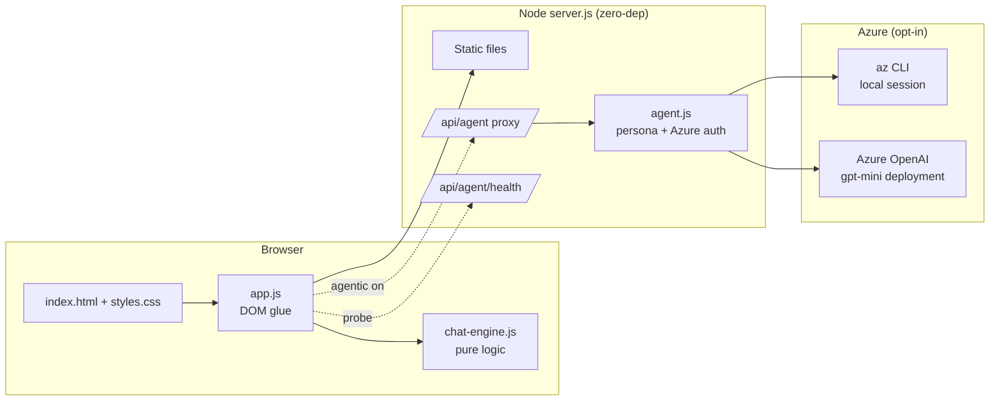
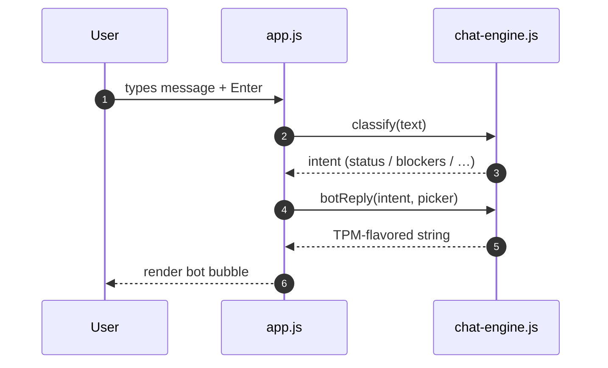
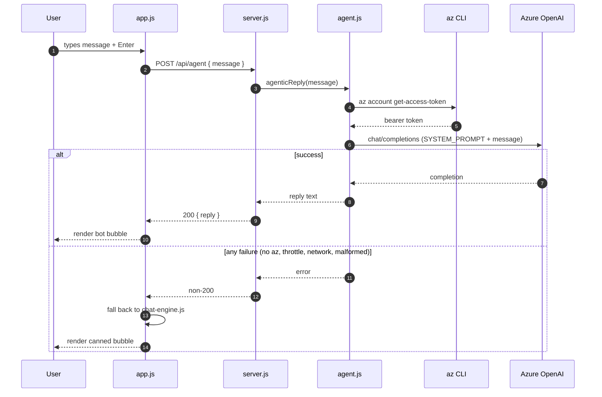

<!-- markdownlint-disable-file -->
# Architecture Overview — Demo Chat TPM

A single-page chat app with two interchangeable reply engines: a canned,
deterministic engine that ships by default, and an opt-in agentic engine
backed by Azure OpenAI.

The decisions behind this architecture live as ADRs in
[`.copilot-tracking/adrs/2026-04-28/`](../../.copilot-tracking/adrs/2026-04-28).
This file is the human-readable map; the ADRs are the source of truth.

| Decision | ADR |
|---|---|
| Static stack, zero build, ES modules | [ADR-001](../../.copilot-tracking/adrs/2026-04-28/ADR-001-static-stack.md) |
| Canned, deterministic-ish replies | [ADR-002](../../.copilot-tracking/adrs/2026-04-28/ADR-002-canned-responses.md) |
| Opt-in agentic mode (Azure CLI + Azure OpenAI) | [ADR-003](../../.copilot-tracking/adrs/2026-04-28/ADR-003-azure-agentic-mode.md) |

## Components

* `chat-engine.js` is **pure** — no DOM, no network — and is fully
  unit-tested. It owns intent classification and the no-repeat reply
  picker (ADR-002).
* `app.js` is the only DOM consumer. It calls the engine for canned
  replies and, when agentic mode is enabled and healthy, posts to
  `/api/agent` instead.
* `server.js` serves static files and, only when all three
  `AZURE_OPENAI_*` env vars are set, exposes `/api/agent` and
  `/api/agent/health`.
* `agent.js` shells out to `az account get-access-token` and proxies
  requests to Azure OpenAI with the locked TPM persona prompt.

## Reply flow — canned mode (default)

## Reply flow — agentic mode (opt-in)

The fallback path is the safety net required by ADR-003: any failure in
the agentic path silently degrades to the canned engine, so the demo
never shows a broken state.

## Boundaries and invariants

* No secrets in the repo. The browser never sees an Azure token.
* No runtime npm dependencies. Tests use `vitest` + `jsdom` (dev only).
* `chat-engine.js` must not import the DOM. Enforced by code review and
  by the unit-test suite running it under plain Node.
* Agentic mode is **off** unless all three `AZURE_OPENAI_*` vars are set.
